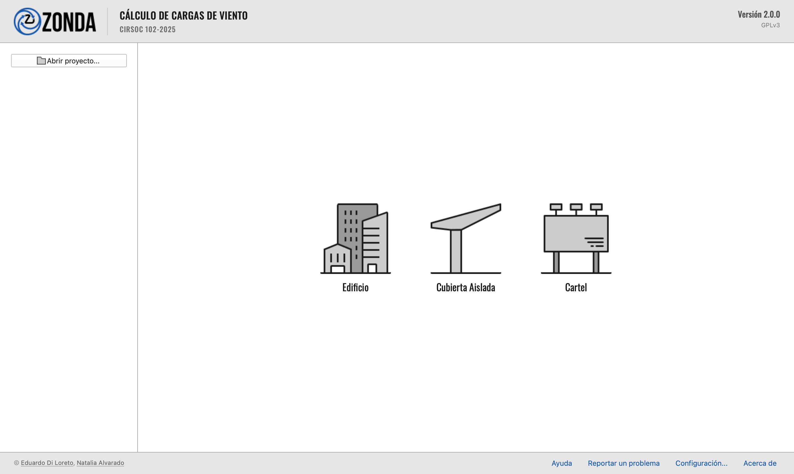
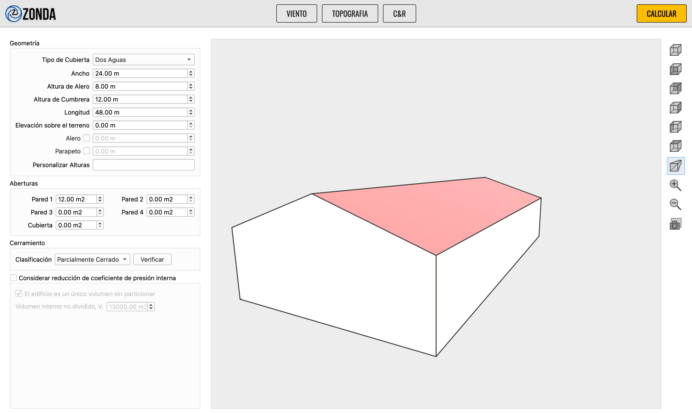
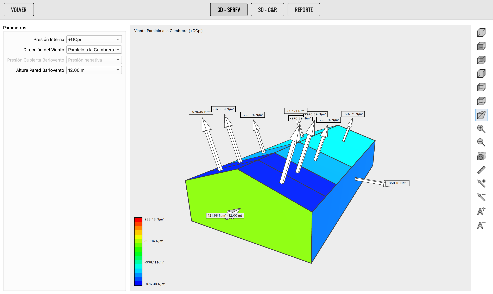
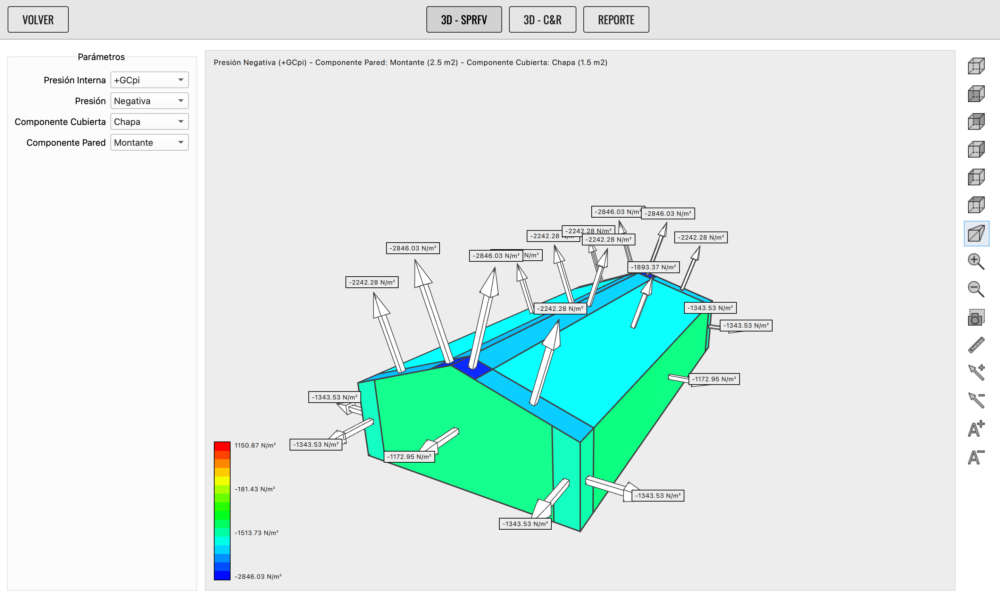
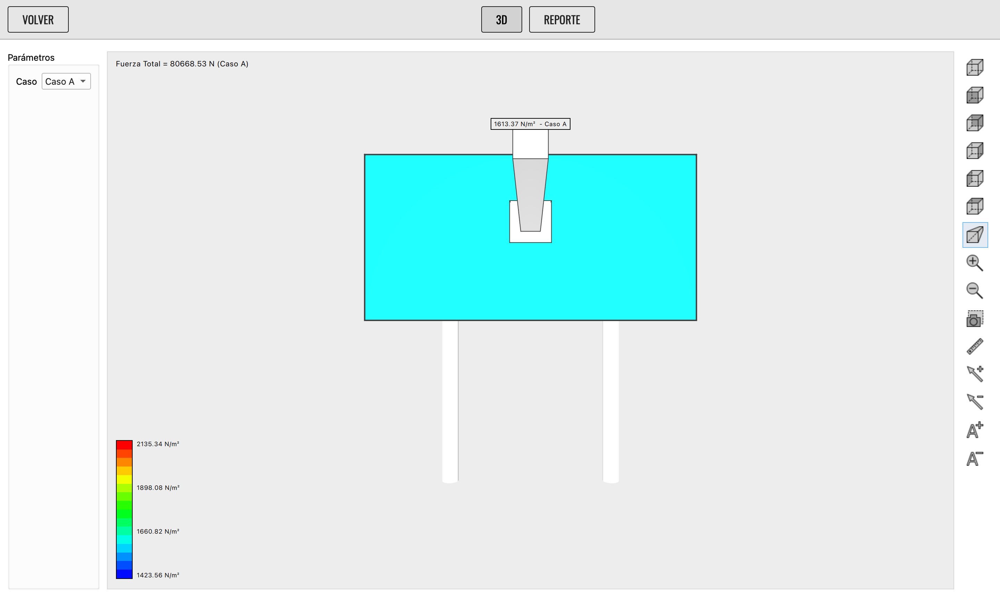
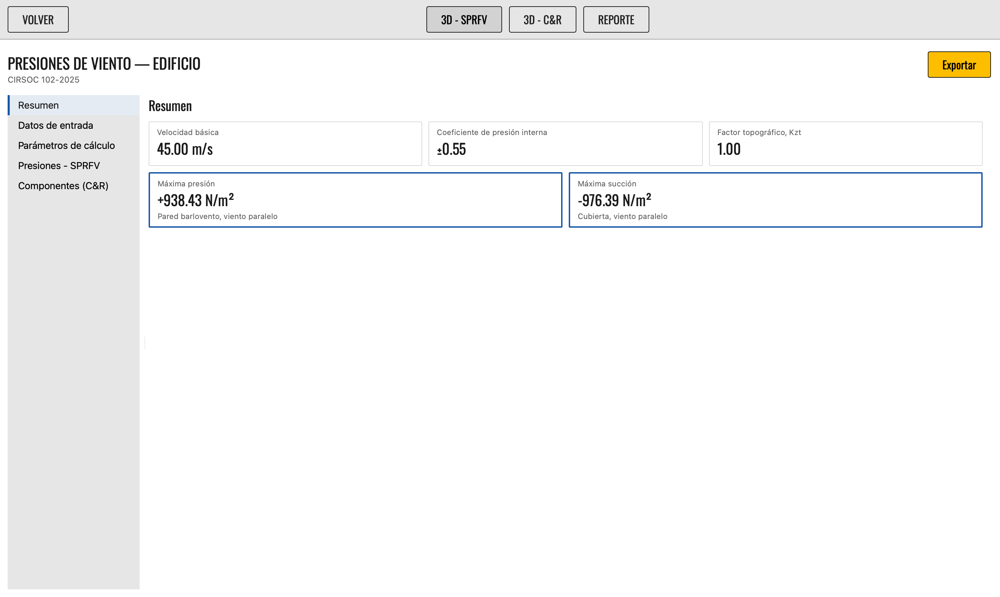

Software libre de escritorio para el cálculo de cargas y presiones de viento en estructuras según el reglamento argentino **CIRSOC 102-2025**.

[](https://www.gnu.org/licenses/gpl-3.0)
[](https://www.python.org/)


---

## Características

- **Cálculo reglamentario (CIRSOC 102-2025):**
  - Determinación de presiones dinámicas $q_z$ y $q_h$.
  - Factores de ráfaga ($G$), direccionalidad ($K_d$), altitud ($K_e$) y efecto topográfico ($K_{zt}$).
  - Coeficientes de presión externa ($C_p$) e interna ($GC_{pi}$).
  - Cargas en el Sistema Principal Resistente a la Fuerza del Viento (SPRFV) y en Componentes y Revestimientos (C&R).
- **Tipologías estructurales:**
  - **Edificios:** cerrados y parcialmente cerrados, cubiertas planas, a un agua y a dos aguas, con o sin parapetos.
  - **Carteles y muros:** sobre terreno o elevados, con soporte estructural.
  - **Cubiertas aisladas:** a un agua, dos aguas y abovedadas, abiertas o con obstrucciones.
- **Visualización 3D interactiva (Qt Quick 3D):**
  - Mapeo de presiones con escala de colores en tiempo real.
  - Vectores y etiquetas de presión direccionales con control de oclusión.
  - Vistas ortogonales fijas, perspectiva cónica/ortográfica y herramienta de medición de distancias entre vértices.
- **Reporte de resultados:**
  - Reporte en pantalla con índice, resumen y detalle de cálculo por zona.
  - Exportación directa a PDF con el motor de texto nativo de Qt.
- **Gestión de proyectos:**
  - Guardado y apertura del estado de trabajo en formato de archivo nativo `.zda`.

---

## Capturas de pantalla

| Bienvenida | Edificio: datos de entrada |
| :---: | :---: |
|  |  |

| Edificio: 3D SPRFV | Edificio: 3D C&R |
| :---: | :---: |
|  |  |

| Cartel: 3D | Reporte de resultados |
| :---: | :---: |
|  |  |

---

## Instalación

### Instaladores listos para usar (Recomendado)

Podés descargar el instalador ejecutable correspondiente a tu sistema operativo directamente desde la **[última release](https://github.com/efdiloreto/ZondaPro/releases/latest)**:

- **Windows:** Instalador `.msi`
- **macOS:** Imagen de disco `.dmg`
- **Linux:** Paquete `.flatpak` (se instala con `flatpak install --user Zonda-*.flatpak`)

> **Nota:** Los instaladores oficiales ya incluyen todas las herramientas necesarias: la exportación a PDF la hace Zonda por sí solo.

---

### Ejecución desde el código fuente

Requiere [uv](https://docs.astral.sh/uv/getting-started/installation/) y Python 3.13 o superior.

1. Cloná este repositorio:
   ```bash
   git clone https://github.com/efdiloreto/ZondaPro.git
   cd ZondaPro/python
   ```

2. Sincronizá el entorno y ejecutá Zonda:
   ```bash
   uv sync
   uv run zonda
   ```

> `uv sync` creará el entorno virtual e instalará Python 3.13 automáticamente si no está disponible en el sistema.
>
> No se necesita nada más: la exportación a PDF usa el motor de texto de Qt y viaja con las dependencias del proyecto.

---

## Desarrollo

Desde el directorio `python/`:

```bash
uv run pytest           # Ejecutar suite de tests
uv run ruff check .     # Análisis estático (linter)
uv run ruff format .    # Formateo de código
uv run mypy zonda       # Verificación de tipos
```

Para más detalles sobre la arquitectura interna, el motor de cálculo y la capa gráfica 3D, consultá [AGENTS.md](AGENTS.md).

---

## Privacidad

Zonda envía estadísticas anónimas de uso **activadas por defecto** (modelo [Homebrew](https://docs.brew.sh/Analytics)). Cada vez que se abre el programa sale **un único pedido** con:

- la versión de Zonda y el sistema operativo,
- un número aleatorio generado en tu máquina que identifica la instalación, sin ningún vínculo con tu persona,
- el país aproximado, que el servidor deduce de la IP. La IP **no se guarda**.

Nunca se envían datos personales ni del contenido de tus proyectos, ni siquiera los nombres de los archivos. Los números agregados sirven para saber cuánta gente usa Zonda y decidir con evidencia dónde poner el esfuerzo en el futuro del proyecto.

Si preferís no participar, desactivá la casilla en **Configuración → Telemetría**. También se puede arrancar sin telemetría con la variable de entorno `ZONDA_SIN_TELEMETRIA=1`.

---

## Contribuir

Toda ayuda es bienvenida: reportar un error, discutir una figura del Reglamento, mejorar la interfaz o sumar código.

- **[Guía de contribución](.github/CONTRIBUTING.md):** entorno de desarrollo, convenciones, tests y flujo de ramas.
- **[Reportar un error o proponer una funcionalidad](https://github.com/efdiloreto/ZondaPro/issues/new/choose):** si un número no coincide con lo que da el Reglamento a mano, ese es el reporte más valioso que podés hacer.
- **[Código de Conducta](.github/CODE_OF_CONDUCT.md)**
- **[Política de seguridad](SECURITY.md):** las vulnerabilidades se reportan en privado, no como issue.

---

## Licencia

Zonda es software libre: podés redistribuirlo y/o modificarlo bajo los términos de la [Licencia Pública General de GNU](LICENSE), versión 3 o posterior, publicada por la Free Software Foundation.

Se distribuye con la esperanza de que sea útil, pero **SIN NINGUNA GARANTÍA**; ni siquiera la garantía implícita de **COMERCIALIZACIÓN** o **APTITUD PARA UN PROPÓSITO PARTICULAR**. Consultá la Licencia Pública General de GNU para más detalles.

Copyright (c) 2018-2026 Eduardo Di Loreto <efdiloreto@gmail.com>, Natalia Alvarado <mnaa85@gmail.com>
